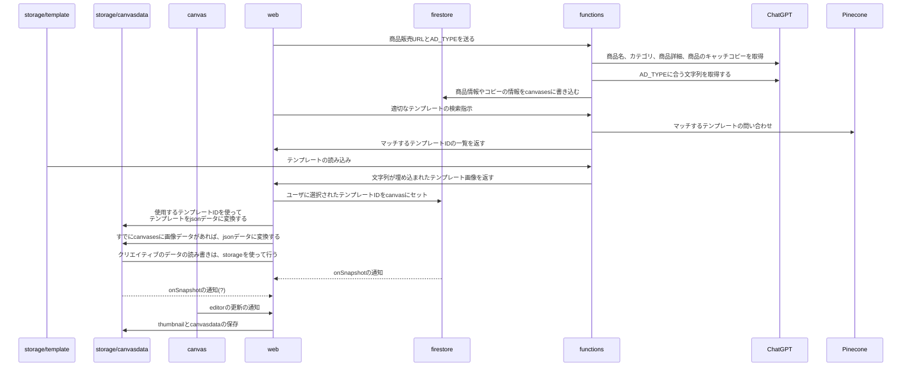

# Synapse X Genius

Synapse X Genius のプロトタイプのためのレポジトリです。

## セットアップ方法

以下の手順でアプリケーションをセットアップします。

**必要な環境:** Node.js v18.0.0 以上。Node.jsのバージョン18をインストールするには、`nvm install 18` を実行してください。

1. **プロジェクトのクローンを作成します：**

   ```bash
   git clone git@github.com:tipo122/synapse-genius.git
   cd synapse-genius
   ```

1. **依存関係をインストールします：**

   ```bash
   yarn install
   ```

1. **環境変数を設定します**

   ### 通常の方法

   .env.local ファイルを作成し、以下の内容を設定します

   ```
   OPENAI_API_KEY=
   REACT_APP_FIREBASE_APIKEY=
   REACT_APP_FIREBASE_AUTHDOMAIN=
   REACT_APP_FIREBASE_PROJECTID=
   REACT_APP_FIREBASE_STORAGEBUCKET=
   REACT_APP_FIREBASE_MESSAGINGSENDERID=
   REACT_APP_FIREBASE_APPID=
   REACT_APP_FIREBASE_MEASUREMENTID=
   ```

   ### dotenv-vault を使って取り出す方法(調整中)

   dotenv-vault を使って、.env ファイルを取得します。

   ```
   npx dotenv-vault@latest pull
   ```

   functions の.env ファイルも取得する必要があります。

   ```
   cd functions
   npx dotenv-vault@latest pull
   ```

1. **開発サーバーを起動します：**

   ```bash
   yarn start
   ```

   これでアプリケーションは`localhost:3000`で動作します。

## firebase cloud functions デプロイ方法

1. **Firebase へのログインと project の指定**

   ブラウザで許可をします。

   ```bash
   $ firebase login
   ```

   開発環境の場合:

   ```bash
   $ firebase use synapse-genius-dev-fbe11
   ```

1. **Funtions Python の環境設定**
   functions フォルダに移って、以下のコマンドを実行します

   ```bash
   $ cd functions

   $ python3 -m venv venv

   $ source ./venv/bin/activate && python3 -m pip install -r requirements.txt
   ```

1. **Funtions Node の環境設定**
   functions フォルダに移って、以下のコマンドを実行します

   ```bash
   $ cd functions

   $ npm i --prefix ./tsfunctions

   $ npm run build --prefix ./tsfunctions
   ```

1. **ローカル実行(全ての functions を実行)**

   ```bash
   $ firebase emulators:start --only functions
   ```

1. **デプロイ**

   ```bash
   $ firebase deploy --only functions
   ```

## 開発ワークフロー

1.  **ブランチ作成** `development`ブランチから新しいブランチを作成し、`feature/<機能名>`の命名規則に従います。

    ```bash
    git checkout -b feature/xxxx development
    ```

1.  **機能開発** 新しいブランチで必要な変更を行い、それをコミットします。

    ```bash
    git add .
    git commit -m "新機能 xxxx の実装"
    ```

1.  **テンプレート生成** `scaffdog` を使用して、新しいコンポーネントやページのテンプレートを生成することができます。これを行うには、ターミナルで以下のコマンドを実行してください：

    ```bash
    npx scaffdog generate
    ```

    実行すると、`component` または `page` のテンプレートを選択するプロンプトが表示されます。

1.  **プルリクエスト作成** ブランチをリモートリポジトリにプッシュし、development ブランチへのプルリクエストを作成します。

1.  **コードレビューとマージ** チームメイトがコードをレビューします。修正が必要な場合は、それを行い、再度プッシュします。
    承認されたら、プルリクエストを development ブランチにマージします。

        development ブランチにマージされると、開発環境にコードがデプロイされます。

    デプロイされたコードは以下の url からアクセスできます。

        https://synapse-genius-dev-fbe11.web.app/

1.  **デプロイ** 準備が整ったら、development ブランチから main ブランチへのプルリクエストを作成します。適切なレビューとテストの後、このプルリクエストをマージして新機能を本番環境にデプロイします。

    https://synapse-genius.web.app/

## テクニカルガイドライン

1. **Canvas 関連データの取得方法について**

Canvasに関連するデータを取得する際には、`useContext` フックを用いて `CanvasContext` から直接データを取得するようにしてください。このアプローチは、`useCanvasData` カスタムフックを使用するよりも安全で効率的です。

使用方法:

```tsx
import { CanvasContext } from "@pages/Canvas/Canvas";
const { canvasData, saveCanvasData } = useContext(CanvasContext);
```

# FireStore Collections

```ts
canvases: {
   uid: string,
   user_id: string,
   template_id: string,
   copydata: map {
      strings: array [
         strings: string,
         ...
      ]
   }
   bg_image_uid: reference,
   bg_image_prompt: string,
   collaborators: array [
      email: string,
      ...
   ]
   item_property: map {
      item_name: string,
      item_category: string,
      item_description: string,
   }
   campaign_property: map {
      campaign_name: string,
      campaign_description: string,
   }
   collaborators: array [
      {user_id: string}
      ...
   ]
   create_dt: timestamp,
   update_dt: timestamp,
}

prompts: {
   uid: string,
   user_id: string,
   prompt: PromptObject,
   messages: array [
      {role: string, message: string}
   ]
   create_dt: timestamp,
   update_dt: timestamp,
}
```

## フォルダ構成

```
src/
├── index.tsx
├── App.tsx
├── components/ (UIの一部を構成する再利用可能な部品)
│   ├── CanvasPane/
│   ├── ChatArea/
│   ├── ImageDrawer/
│   ├── ImageUpload/
│   ├── Insight2/
│   ├── ItemProperty/
│   ├── ObjectDrawer/
│   ├── OtherDrawer/
│   ├── TextDrawer/
│   └── TextStyle/
├── containers/ (ビジネスロジックやデータの処理など、コンポーネントよりも上位の階層に位置し、複数のコンポーネントをまとめる)
│   ├── Dashboard/
│   └── Create/
│       ├── CreateStart.tsx
│       ├── CreateList.tsx
│       └── CreateContainer.tsx
├── firebase.ts
├── hooks/
│   ├── useCanvasData.ts
│   ├── useChatCompletion.ts
│   └── useFabricJSEditor.tsx
├── pages/
│   ├── Canvas/
│   ├── Home/
│   ├── Login/
│   └── Page1/
├── types/
|   ├── canvas.ts
|   ├── defaultShapes.ts
|   └── user.ts
└── styles/ (not yet)
    |- variables.css (カスタムプロパティ)
    |- reset.css (リセットCSS)
    |- global.css (全体共通のスタイル)
    └── utils/ (コンポーネント間で共有するスタイル)
```

## シーケンス図

### キャンバスの流れ



## Python の local での単体動作

py_test 以下のファイルを参考に、functions のファイルの機能を local で動かして検証する

```
python -m py_test.hello
```
